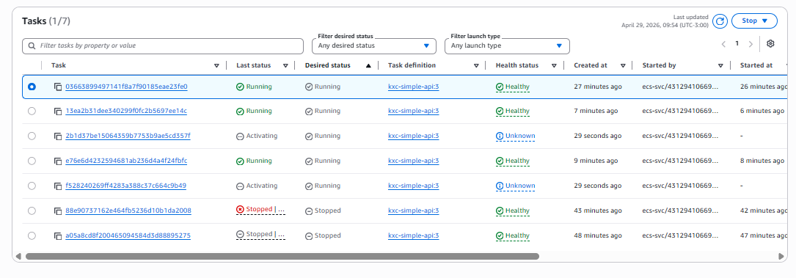
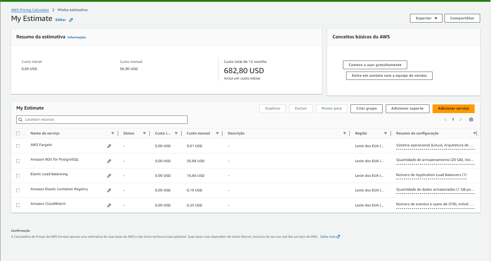

# kxc-simple-api

API REST em Node.js com conexão a banco de dados PostgreSQL, rodando em infraestrutura AWS provisionada com Terraform e entregue via pipelines automatizadas no GitHub Actions.

---

## Rotas

| Método | Rota       | Descrição                                            |
|--------|------------|------------------------------------------------------|
| GET    | `/`        | Retorna status da API e contador de requisições      |
| GET    | `/connect` | Conecta ao banco e retorna a versão do PostgreSQL    |

---

## Variáveis de ambiente

| Variável      | Descrição                  | Padrão |
|---------------|----------------------------|--------|
| `API_PORT`    | Porta da API               | `3000` |
| `DB_HOST`     | Endereço do banco          | —      |
| `DB_PORT`     | Porta do banco             | `5432` |
| `DB_DATABASE` | Nome do banco de dados     | —      |
| `DB_USER`     | Usuário do banco           | —      |
| `DB_PASSWORD` | Senha do banco             | —      |

---

## Infraestrutura

> Diagrama completo em [`docs/kxc-simple-api.html`](docs/kxc-simple-api.html)

### Auto Scaling em ação

Tasks escalando horizontalmente conforme a carga aumenta:



### Componentes

**Rede**
- VPC `172.16.0.0/16` em `us-east-1` com 2 zonas de disponibilidade
- 2 subnets públicas (`172.16.1.0/24`, `172.16.2.0/24`) — ALB e ECS
- 2 subnets privadas (`172.16.3.0/24`, `172.16.4.0/24`) — RDS
- Internet Gateway para tráfego externo (sem NAT Gateway)

**Computação**
- ECS Fargate `256 CPU / 512 MB` por task
- Auto Scaling horizontal: mínimo 1, máximo 5 tasks
- Escalonamento por CPU média do serviço (target: 70%)
- Distribuição automática entre zonas de disponibilidade via ALB

**Banco de dados**
- RDS PostgreSQL `db.t3.micro` Multi-AZ
- Primary em `us-east-1a`, Standby em `us-east-1b`
- Replicação síncrona com failover automático (~60s)
- Subnet privada — sem acesso público

**Segurança**
- ALB SG: aceita HTTP (porta 80) da internet
- ECS SG: aceita tráfego apenas do ALB
- RDS SG: aceita PostgreSQL (porta 5432) apenas do ECS
- Credenciais do banco armazenadas no SSM Parameter Store (SecureString)
- Imagem do container com usuário não-root (`node`)

**Observabilidade**
- Container Insights habilitado no ECS cluster
- Logs centralizados no CloudWatch (`/ecs/kxc-simple-api`, retenção 7 dias)

---

## Segurança

### Rede

- **Subnets privadas para o RDS** — o banco não tem IP público e não é acessível pela internet, apenas pelas tasks ECS dentro da VPC
- **Security Groups com least privilege** — cada camada só aceita tráfego da camada imediatamente anterior:
  - ALB SG: aceita HTTP (80) da internet
  - ECS SG: aceita tráfego apenas do ALB SG
  - RDS SG: aceita PostgreSQL (5432) apenas do ECS SG
- **Sem NAT Gateway** — as tasks ECS ficam em subnet pública com IP próprio, mas o RDS continua isolado em subnet privada sem rota para a internet

### Credenciais

- **SSM Parameter Store (SecureString)** — a senha do banco é armazenada criptografada com KMS e nunca aparece em texto claro no código, no Terraform state ou nas variáveis de ambiente em texto puro da task definition
- A task definition referencia o ARN do parâmetro via `secrets`, e o ECS injeta o valor em runtime — a aplicação recebe a senha como variável de ambiente sem que ela trafegue pelo código
- A IAM role de execução do ECS tem permissão mínima: só lê exatamente o parâmetro da senha do banco (`ssm:GetParameter` no ARN específico)

### Container

- A imagem roda com usuário não-root (`node`) — um processo comprometido dentro do container não tem privilégios de root no host

### IAM

- **Least privilege** — o IAM user usado nas pipelines do GitHub Actions tem apenas as permissões necessárias para o deploy: ECR push, ECS update, SSM read e Terraform state no S3/DynamoDB
- Nenhuma política `*` ou `AdministratorAccess` no user de CI/CD

---

## Testes de resiliência

### Auto-recovery de tasks

Ao parar uma task manualmente via console ECS, o serviço detecta que o `desired_count` não está satisfeito e provisiona uma nova task automaticamente em ~30 segundos, sem intervenção manual.

### Auto Scaling por CPU

Carga gerada com `wrk` contra o ALB:

```bash
wrk -t4 -c300 -d10m http://<alb-endpoint>/
```

Com CPU média do serviço acima de 70% por 2 períodos consecutivos de 60s, o Application Auto Scaling provisiona novas tasks. Ao cessar a carga, o scale in ocorre após 300s de CPU abaixo do target, voltando ao mínimo de 1 task.

---

## CI/CD

Duas pipelines independentes no GitHub Actions, disparadas automaticamente por mudanças nos arquivos correspondentes.

### Pipeline: Terraform

Dispara quando arquivos em `terraform/` são alterados.

```
Plan ──► Apply
```

| Stage   | O que faz                                              |
|---------|--------------------------------------------------------|
| `Plan`  | Init, fmt check, validate, gera o plano de execução    |
| `Apply` | Aplica o plano — só roda no merge para `main`          |

### Pipeline: Deploy

Dispara quando `src/`, `Dockerfile` ou `package*.json` são alterados.

```
Build ──► Deploy
```

| Stage    | O que faz                                              |
|----------|--------------------------------------------------------|
| `Build`  | Build da imagem Docker, push para ECR (SHA + latest)   |
| `Deploy` | Registra nova task definition, atualiza serviço ECS    |

> Ambas as pipelines podem ser disparadas manualmente via **Actions → Run workflow**.

---

## Custos estimados



Estimativa mensal para a infraestrutura rodando 24/7 em `us-east-1`:

| Serviço                  | Custo/mês |
|--------------------------|-----------|
| ECS Fargate (1 task)     | $9,01     |
| RDS PostgreSQL Multi-AZ  | $30,88    |
| Application Load Balancer| $16,66    |
| ECR                      | $0,10     |
| CloudWatch               | $0,25     |
| **Total**                | **~$56,90** |

### Decisões que reduziram o custo

| O que não usamos         | Economia estimada | Motivo                                                                 |
|--------------------------|-------------------|------------------------------------------------------------------------|
| NAT Gateway              | ~$32/mês + dados  | Tasks ECS em subnet pública com `assign_public_ip = true`              |
| AWS Secrets Manager      | ~$0,40/secret/mês | Substituído por SSM Parameter Store (SecureString) — gratuito          |
| RDS Proxy                | proporcional ao RDS| Não necessário para a escala atual                                    |
| CloudWatch Database Insights | variável     | Monitoramento básico suficiente para o projeto                         |
| RDS Extended Support     | variável          | PostgreSQL 16 ainda em suporte padrão                                  |

### Como reduzir ainda mais (trade-offs)

| Mudança                        | Economia           | Trade-off                                      |
|--------------------------------|--------------------|------------------------------------------------|
| RDS Single-AZ                  | ~$15/mês           | Sem failover automático em caso de falha de AZ |
| Fargate Spot                   | até 70% do Fargate | Tasks podem ser interrompidas pela AWS         |
| Reserved Instance (RDS, 1 ano) | até 40% do RDS     | Compromisso de 1 ano de uso                    |

---

## Estado do Terraform

O estado é armazenado remotamente com lock para evitar execuções simultâneas.

| Recurso       | Nome                       |
|---------------|----------------------------|
| S3 bucket     | `kxc-simple-api-tfstate`   |
| DynamoDB lock | `kxc-simple-api-tflock`    |

---

## Secrets necessários no GitHub

| Secret                  | Descrição                        |
|-------------------------|----------------------------------|
| `AWS_ACCESS_KEY_ID`     | Access key do IAM user de deploy |
| `AWS_SECRET_ACCESS_KEY` | Secret key do IAM user de deploy |

---

## Estrutura do projeto

```
.
├── src/
│   └── index.js              # Aplicação Node.js
├── terraform/
│   ├── vpc.tf                # VPC, subnets, Internet Gateway
│   ├── security_groups.tf    # SGs do ALB, ECS e RDS
│   ├── ecr.tf                # Repositório de imagens
│   ├── iam.tf                # Roles de execução do ECS
│   ├── ssm.tf                # Credenciais do banco (SecureString)
│   ├── rds.tf                # PostgreSQL Multi-AZ
│   ├── ecs.tf                # Cluster, tasks, ALB, Auto Scaling
│   ├── variables.tf
│   ├── outputs.tf
│   └── versions.tf
├── .github/
│   └── workflows/
│       ├── terraform.yml     # Pipeline de infraestrutura
│       └── deploy.yml        # Pipeline de aplicação
├── docs/
│   ├── kxc-simple-api.html        # Diagrama da arquitetura
│   ├── ecs-tasks-autoscaling.png  # Auto Scaling em ação
│   └── aws-calculator.png         # Estimativa de custos
└── Dockerfile
```
